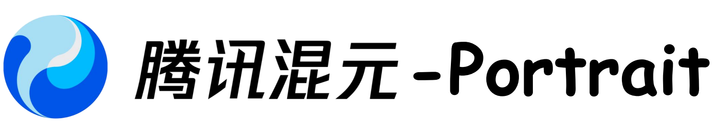

<p align="center">
  
</p>

<div align="center">
<h2><font color="red"> HunyuanPortrait </font></center> <br> <center>Implicit Condition Control for Enhanced Portrait Animation</h2>

<a href='https://arxiv.org/abs/2503.18860'></a> 
<a href='https://kkakkkka.github.io/HunyuanPortrait/'></a>
<a href='https://huggingface.co/tencent/HunyuanPortrait'></a>
</div>

## 🧩 Community Contributions
If you develop/use HunyuanPortrait in your projects, welcome to let us know/sumbit a PR! 💖

## 📜 Requirements
* An NVIDIA 3090 GPU with CUDA support is required. 
  * The model is tested on a single 24G GPU.
* Tested operating system: Linux

## 📥 Installation

```bash
git clone https://github.com/Tencent-Hunyuan/HunyuanPortrait
pip3 install torch torchvision torchaudio
pip3 install -r requirements.txt
```

## 🛠️ Download

All models are stored in `pretrained_weights` by default:
```bash
pip3 install "huggingface_hub[cli]"
cd pretrained_weights
huggingface-cli download --resume-download stabilityai/stable-video-diffusion-img2vid-xt --local-dir . --include "*.json"
wget -c https://huggingface.co/LeonJoe13/Sonic/resolve/main/yoloface_v5m.pt
wget -c https://huggingface.co/stabilityai/stable-video-diffusion-img2vid-xt/resolve/main/vae/diffusion_pytorch_model.fp16.safetensors -P vae
wget -c https://huggingface.co/FoivosPar/Arc2Face/resolve/da2f1e9aa3954dad093213acfc9ae75a68da6ffd/arcface.onnx
huggingface-cli download --resume-download tencent/HunyuanPortrait --local-dir hyportrait
```

And the file structure is as follows:
```bash
.
├── arcface.onnx
├── hyportrait
│   ├── dino.pth
│   ├── expression.pth
│   ├── headpose.pth
│   ├── image_proj.pth
│   ├── motion_proj.pth
│   ├── pose_guider.pth
│   └── unet.pth
├── scheduler
│   └── scheduler_config.json
├── unet
│   └── config.json
├── vae
│   ├── config.json
│   └── diffusion_pytorch_model.fp16.safetensors
└── yoloface_v5m.pt
```

## ▶️ Run

🔥 Live your portrait by executing `bash demo.sh`

```bash
video_path="your_video.mp4"
image_path="your_image.png"

python inference.py \
    --config config/hunyuan-portrait.yaml \
    --video_path $video_path \
    --image_path $image_path
```

## 🏗️ Framework 


## ⏳ TL;DR:
HunyuanPortrait is a diffusion-based framework for generating lifelike, temporally consistent portrait animations by decoupling identity and motion using pre-trained encoders. It encodes driving video expressions/poses into implicit control signals, injects them via attention-based adapters into a stabilized diffusion backbone, enabling detailed and style-flexible animation from a single reference image. The method outperforms existing approaches in controllability and coherence.

# 🖼 Gallery

Some results of portrait animation using HunyuanPortrait.

More results can be found on our [Project page](https://kkakkkka.github.io/HunyuanPortrait/).

## 📂 Cases

<table>
<tr>
<td width="25%">
  
https://github.com/user-attachments/assets/b234ab88-efd2-44dd-ae12-a160bdeab57e

</td>
<td width="25%">

https://github.com/user-attachments/assets/93631379-f3a1-4f5d-acd4-623a6287c39f

</td>
<td width="25%">

https://github.com/user-attachments/assets/95142e1c-b10f-4b88-9295-12df5090cc54

</td>
<td width="25%">

https://github.com/user-attachments/assets/bea095c7-9668-4cfd-a22d-36bf3689cd8a

</td>
</tr>
</table>

## 🎤 Portrait Singing

https://github.com/user-attachments/assets/4b963f42-48b2-4190-8d8f-bbbe38f97ac6

## 🎬 Portrait Acting

https://github.com/user-attachments/assets/48c8c412-7ff9-48e3-ac02-48d4c5a0633a

## 🤪 Portrait Making Face

https://github.com/user-attachments/assets/bdd4c1db-ed90-4a24-a3c6-3ea0b436c227

## 💖 Acknowledgements

The code is based on [SVD](https://github.com/Stability-AI/generative-models), [DiNOv2](https://github.com/facebookresearch/dinov2), [Arc2Face](https://github.com/foivospar/Arc2Face), [YoloFace](https://github.com/deepcam-cn/yolov5-face). We thank the authors for their open-sourced code and encourage users to cite their works when applicable.
Stable Video Diffusion is licensed under the Stable Video Diffusion Research License, Copyright (c) Stability AI Ltd. All Rights Reserved.
This codebase is intended solely for academic purposes.

# 🔗 Citation 
If you think this project is helpful, please feel free to leave a star⭐️⭐️⭐️ and cite our paper:
```bibtex
@article{xu2025hunyuanportrait,
  title={HunyuanPortrait: Implicit Condition Control for Enhanced Portrait Animation},
  author={Xu, Zunnan and Yu, Zhentao and Zhou, Zixiang and Zhou, Jun and Jin, Xiaoyu and Hong, Fa-Ting and Ji, Xiaozhong and Zhu, Junwei and Cai, Chengfei and Tang, Shiyu and Lin, Qin and Li, Xiu and Lu, Qinglin},
  journal={arXiv preprint arXiv:2503.18860},
  year={2025}
}
``` 
